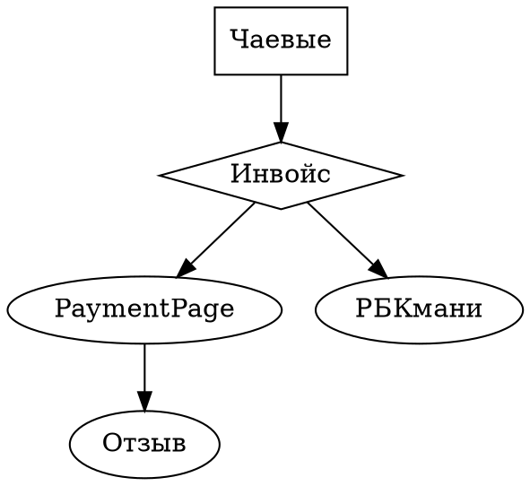

### Wallet

Предлагая пользователю в первую очередь оценить обслуживание 
мы меняем стресс от покупки на более позитивное действие - 
возможность высказать своё мнение а оплата это уже как подверждение
этого мнения, крайне эффектным так же будет возможность оставить 0 чаевых
и в таком случае тескт отзыва становится обязательным

В данном сервисе одновременно два "Покупателя" цели испоользования 
очень отличаются 